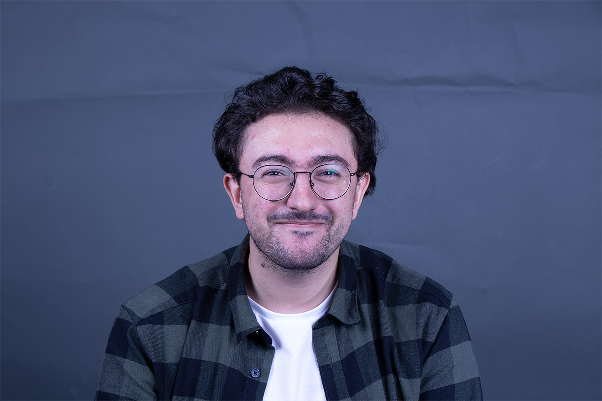
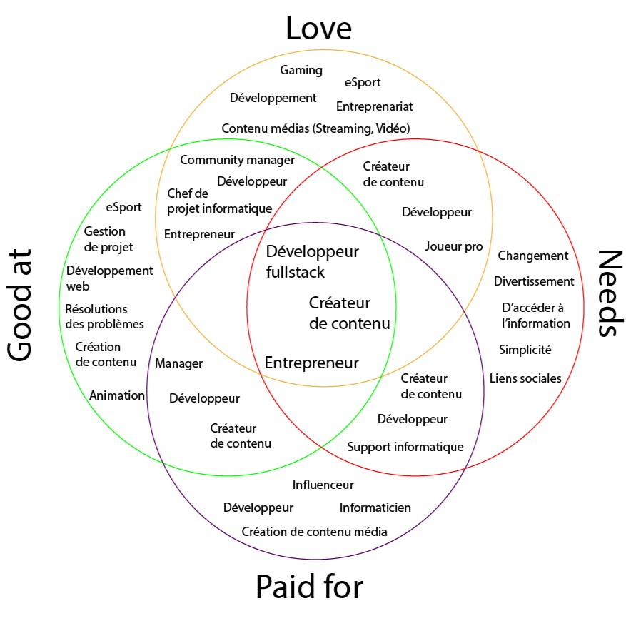

+++
title = 'À Propos'
date = 2024-01-25T17:58:57+01:00
draft = false
+++

## Qui suis-je ?

Je suis un étudiant de 25 ans, actuellement en 3ème année d'ingénierie des médias à la HEIG-VD 🎓.

Depuis mon plus jeune âge, j'ai toujours su que ma passion se trouvait dans l'univers de l'informatique 💻❤️. 

C'est pourquoi, en 2015, j'ai obtenu un CFC d'informaticien. Ensuite, j'ai poursuivi avec une formation de technicien ES en informatique, me spécialisant dans le développement d'applications 🛠️📲.

Ce qui me fascine par-dessus tout dans les projets que je réalise, c'est cette incroyable diversité. Chaque projet est une nouvelle aventure, avec ses propres défis et la chance de rencontrer de nouvelles personnes 🌍🤝.

Pour moi, il est primordial de placer la personne au cœur de chaque projet. Nous avons souvent tendance à oublier que nos projets ne sont pas juste pour des clients, mais pour des personnes réelles, avec leurs propres histoires et besoins ❤️.

## Pourquoi Hugo ?

J'ai choisi Hugo pour mon blog parce qu'il est facile à utiliser et rapide pour publier des articles. Il me permet de personnaliser mon site selon mes goûts. 

Son intégration avec des outils comme Github Pages rend tout le processus de publication  plus simple 🚀.

## Mon Ikigai

Comme le révèle mon ikigai, je me définis à travers plusieurs vocations : Développeur fullstack 💻, Créateur de contenu 🎥, et Entrepreneur 👔.

L'intérêt de ces domaines est qu'ils s'entremêlent aisément. Par exemple, un entrepreneur pourrait lancer une agence web 🌐, ou un créateur de contenu pourrait réaliser des vidéos sur le développement web 📹.

Dans ce blog, je me concentre sur l'un des piliers de mon ikigai : le développement web. Pour moi, ce domaine a toujours été une vocation, un rêve de jeunesse quand, en tant que jeune gamer, je souhaitais créer mes propres jeux 🕹️ – quel petit gamer n'en a pas rêvé ?

Dans mon "Qui suis-je", j'ai évoqué ce qui me rattache à ce domaine, mais c'est surtout cet esprit d'aventure : chaque nouveau projet représente un défi inédit 🎯 et l'opportunité de croiser le chemin de nouvelles personnes 👥.